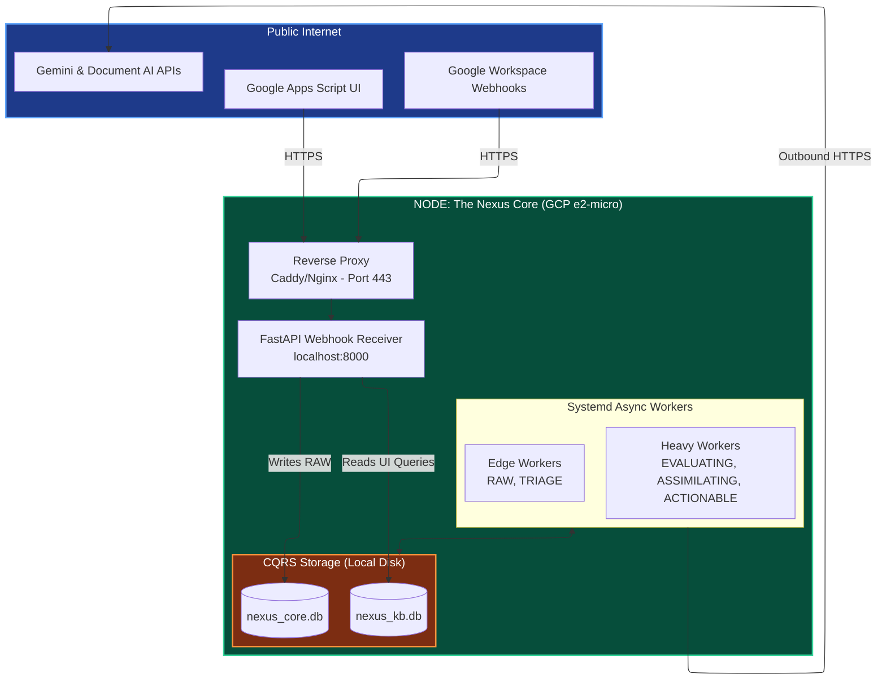

# Layer 0: Resource Topology & Infrastructure

## 0.1 Day Zero Architecture: The Single-Node Monolith
To ensure rapid development, operational simplicity, and immediate MVP deployment, Nexus V3 operates entirely within a single, highly optimized Virtual Machine.

While the logical architecture (CQRS databases and isolated worker loops) is designed to be easily split across a mesh network in the future, co-locating them on Day 0 ensures zero network latency for SQLite filesystem locks and simplifies the DevOps pipeline.

## 0.2 The Physical Infrastructure (GCP Edge)
- **Infrastructure:** Google Cloud Platform (GCP) `e2-micro` (Always Free Tier).
- **Resources:** 2 vCPUs (burstable), 1GB RAM, 30GB Standard Persistent Disk.
- **The 1GB RAM Survival Mandate:** Running a FastAPI server, asynchronous Python ML wrappers, and two SQLite databases on 1GB of RAM will cause Linux Out-Of-Memory (OOM) kernel panics. The `nexus.sh --provision` script **MUST** create a 2GB OS-level swap file (`/swapfile`). 
- **Security:** Exposes standard port 443 (HTTPS) for Google Workspace Webhooks and UI polling via a reverse proxy (e.g., Caddy or Nginx). All internal services bind strictly to `localhost`.

## 0.3 Operational Boundaries
Even though all components share a single VM, they maintain strict isolation to honor the State Machine:
1. **The Ingress API (FastAPI):** Acts strictly as a lightweight receiver. It takes Google Webhooks, drops the JSON payload into `nexus_core.db` as `RAW`, and instantly returns `HTTP 202`. It does *not* wait for AI processing.
2. **The Fusion Engine (systemd):** Background Python processes that independently poll the databases and execute external API calls to Gemini, Document AI, and Google Workspace.
3. **The Data Layer:** Local disk access to `/shared/data/nexus_core.db` and `/shared/data/nexus_kb.db`. Both must use `PRAGMA journal_mode=WAL` to ensure heavy extraction workers do not lock the database and block the fast webhook receiver.

## 0.4 Mermaid Topology Map

