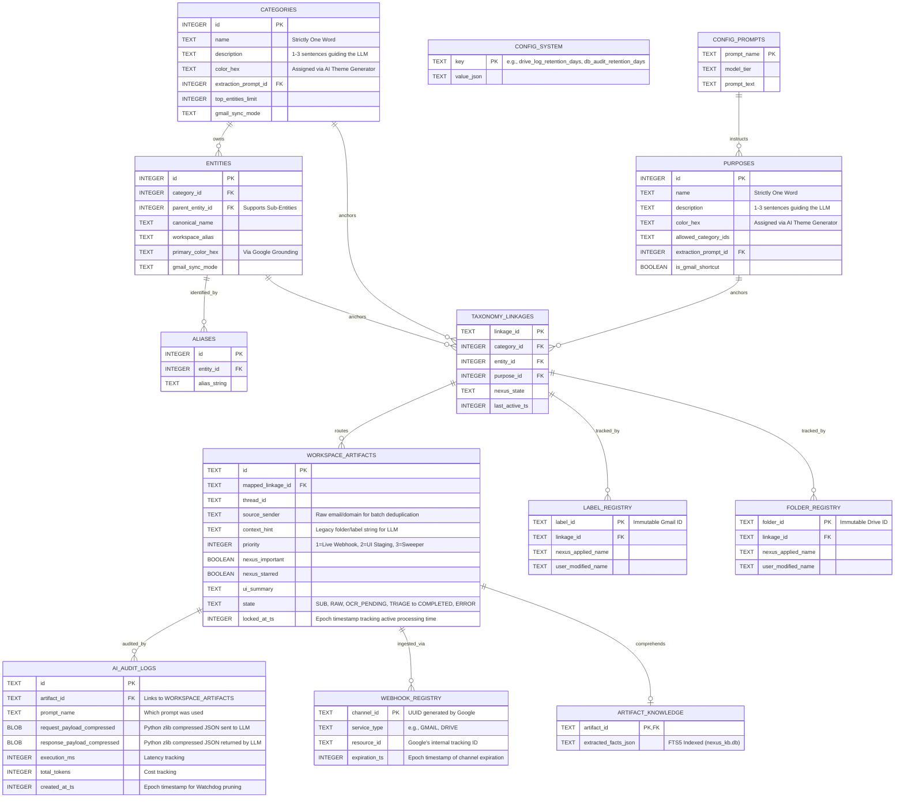

# Layer 2: Data Ontology & Schema (The Truth Matrix)

## 2.1 The CQRS Database Paradigm
Nexus strictly separates operational routing from deep analytical search to guarantee UI performance.

### `nexus_core.db` (The Muscle)
- **Role:** High-speed OLTP. Handles state-machine routing, taxonomy configuration, registries, and webhook ingress.
- **Configuration:** Uses `PRAGMA journal_mode=WAL` and strictly typed tables (`STRICT` keyword). 
- **The Event-Loop Law:** To survive high-concurrency async worker loops and prevent freezing the Python `asyncio` event loop, Python workers MUST interact with databases exclusively using the **`aiosqlite`** async driver with a `timeout=20.0` connection parameter. Synchronous `sqlite3` execution is strictly forbidden.

### `nexus_kb.db` (The Brain)
- **Role:** Heavy OLAP. Handles the Knowledge Base.
- **Configuration:** Houses SQLite `FTS5` (Full-Text Search) Virtual Tables.
- **Data Payload:** Stores the deep JSON key-value key facts extracted by the RAG workers.

## 2.2 The Active Schema Law
Prompts and routing logic are **NOT hardcoded in Python**. The database acts as the Prompt Engineer.
- The `CONFIG_PROMPTS` table holds prompt text and explicit `model_tier` targets (e.g., `gemini-2.5-flash-8b` vs `gemini-1.5-pro`).
- The `PURPOSES` and `CATEGORIES` tables map to these prompts via `extraction_prompt_id`. 
- When an artifact needs extraction, the Python worker queries the database for the assigned prompt. 

## 2.3 The Lexical Law (Taxonomy)
1. **Categories & Purposes:** MUST be exactly **ONE WORD** (e.g., `Finance`, `Discussion`). 
2. **Aliases:** Default to official acronyms (`AWS`, `IRS`).
3. **Canonical Names:** Retain full legal names (`Amazon Web Services, Inc.`) for precise RAG indexing.

## 2.4 Schema Map (Entity Relationship)

