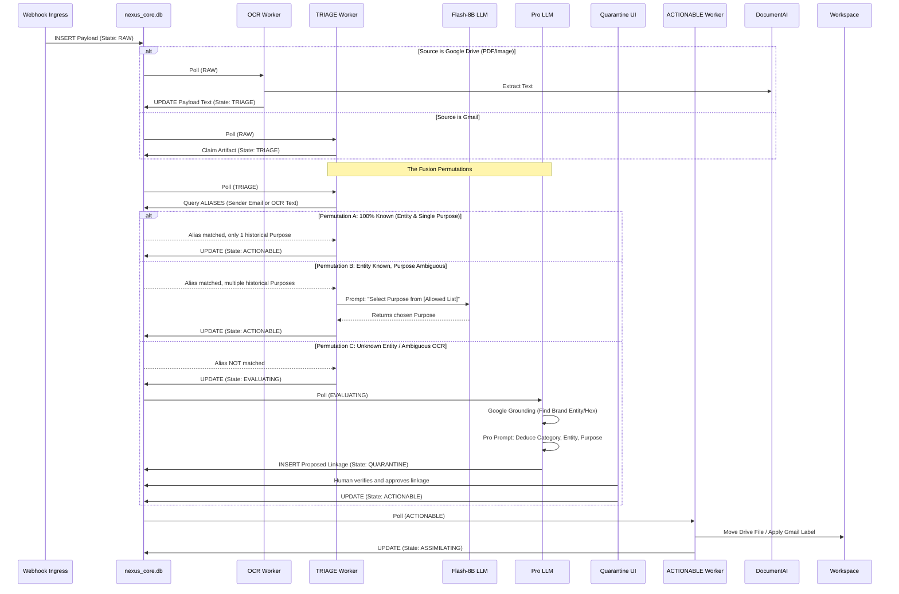

# Layer 3: The State Machine

## 3.1 The Asynchronous Fusion Engine
Nexus V3 contains NO linear Python pipelines. Every step of processing is handled by an isolated, asynchronous worker loop that queries `WORKSPACE_ARTIFACTS` for a specific `state`.

### 🟢 `RAW` (Ingress & Interception)
*   **Trigger:** Webhooks write payload. Returns HTTP 202 instantly.
*   **Bouncer:** Check `CONFIG_SYSTEM` for `ignored_gmail_categories`. If the payload contains tags like `CATEGORY_PROMOTIONS`, transition immediately to `IGNORED` and bypass all AI.

### 🟣 `OCR_PENDING` (Pre-Processing)
*   **Trigger:** Artifacts identified as Google Drive PDFs/Images.
*   **Action:** Transmit via API to **Google Cloud Document AI**. Receive structured text, append to `ocr_payload`. Transition to `TRIAGE`.

### 🟡 `TRIAGE` (Hybrid Routing)
*   **Trigger:** Text/Email artifacts.
*   **Action:** Execute the Hybrid SQL/Micro-LLM pass (See `04_COGNITIVE_AI.md`). 
*   **Outcome:** If Identity and Purpose are confidently resolved and match an active linkage, transition to `ACTIONABLE`. If Identity is unknown or Purpose is novel, transition to `EVALUATING`.

### 🟠 `EVALUATING` (Heavy LLM Fusion)
*   **Trigger:** Novel or ambiguous artifacts.
*   **Action:** Route to heavy reasoning model (See `04_COGNITIVE_AI.md`) to deduce Category, Entity, Sub-Entity, and Purpose simultaneously.
*   **Outcome:** Propose a new taxonomy linkage. Transition to `QUARANTINE`.

### 🔴 `QUARANTINE` (Human-in-the-Loop)
*   **Action:** Worker ignores this state. Artifact waits indefinitely until a human approves the proposed linkage via the UI Taxonomy Management Console. Upon approval, state manually updates to `ACTIONABLE`.

### 🔵 `ACTIONABLE` (Workspace Mutation)
*   **Action:** The Executor reads physical `label_id` / `folder_id` from `LABEL_REGISTRY` and `FOLDER_REGISTRY`. (See `05_WORKSPACE_SYNC.md`).
*   **Physical Sync:** Applies the label/moves the folder natively in Workspace. 
*   **Outcome:** Transition to `ASSIMILATING`.

### 🧠 `ASSIMILATING` (RAG Knowledge Graph Extraction)
*   **Action:** Worker queries `CONFIG_PROMPTS` using the Purpose's `extraction_prompt_id`.
*   **Data Split:** 
    1. Extracts a 1-3 sentence `ui_summary`. Writes to `nexus_core.db`.
    2. Extracts dense JSON key-value facts (e.g., `{"Total": 45.00}`). Writes to `nexus_kb.db`.
*   **Outcome:** Transition to `COMPLETED`.

## 3.2 The Fusion Permutation Sequences

The following Mermaid sequence dictates EXACTLY how artifacts flow through the State Machine based on what is known (SQL) vs. what is unknown (LLMs). Agents MUST NOT invent paths outside of these defined permutations.

