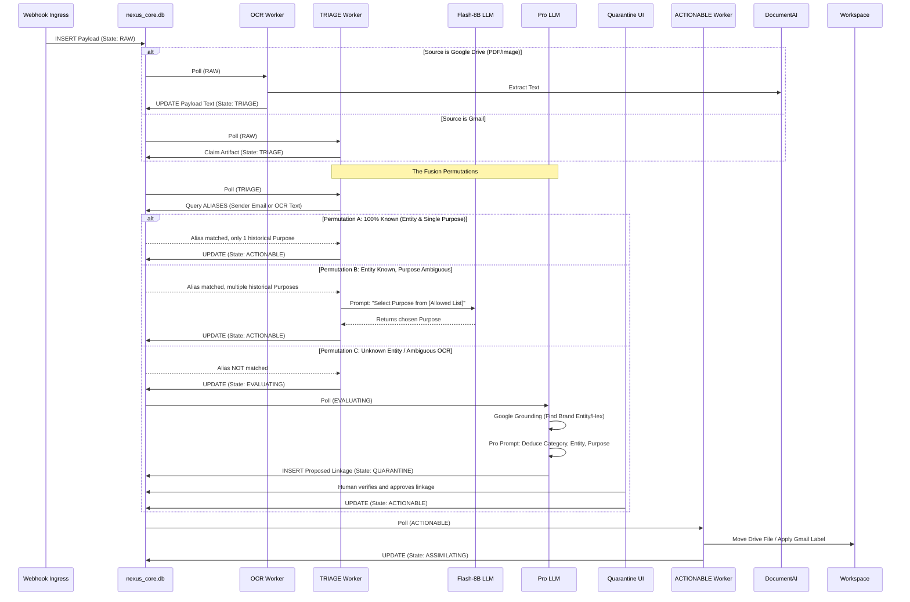

# Layer 3: The State Machine

## 3.1 The Asynchronous Fusion Engine
Nexus V3 contains NO linear Python pipelines. Every step of processing is handled by an isolated, asynchronous worker loop that queries `WORKSPACE_ARTIFACTS` for a specific `state`.

### 🟢 `RAW` (Ingress & Interception)
*   **Trigger:** Webhooks write payload. Returns HTTP 202 instantly.
*   **Bouncer:** Check `CONFIG_SYSTEM` for `ignored_gmail_categories`. If the payload contains tags like `CATEGORY_PROMOTIONS`, transition immediately to `IGNORED` and bypass all AI.

### 🟣 `OCR_PENDING` (Pre-Processing)
*   **Trigger:** Artifacts identified as Google Drive PDFs/Images.
*   **Action:** Transmit via API to **Google Cloud Document AI**. Receive structured text, append to `ocr_payload`. Transition to `TRIAGE`.

### 🟡 `TRIAGE` (Hybrid Routing)
*   **Trigger:** Text/Email artifacts.
*   **Action:** Execute the Hybrid SQL/Micro-LLM pass (See `04_COGNITIVE_AI.md`). 
*   **Outcome:** If Identity and Purpose are confidently resolved and match an active linkage, transition to `ACTIONABLE`. If Identity is unknown or Purpose is novel, transition to `EVALUATING`.

### 🟠 `EVALUATING` (Heavy LLM Fusion)
*   **Trigger:** Novel or ambiguous artifacts.
*   **Action:** Route to heavy reasoning model (See `04_COGNITIVE_AI.md`) to deduce Category, Entity, Sub-Entity, and Purpose simultaneously.
*   **Outcome:** Propose a new taxonomy linkage. Transition to `QUARANTINE`.

### 🔴 `QUARANTINE` (Human-in-the-Loop)
*   **Action:** Worker ignores this state. Artifact waits indefinitely until a human approves the proposed linkage via the UI Taxonomy Management Console. Upon approval, state manually updates to `ACTIONABLE`.

### 🔵 `ACTIONABLE` (Workspace Mutation)
*   **Action:** The Executor reads physical `label_id` / `folder_id` from `LABEL_REGISTRY` and `FOLDER_REGISTRY`. (See `05_WORKSPACE_SYNC.md`).
*   **Physical Sync:** Applies the label/moves the folder natively in Workspace. 
*   **Outcome:** Transition to `ASSIMILATING`.

### 🧠 `ASSIMILATING` (RAG Knowledge Graph Extraction)
*   **Action:** Worker queries `CONFIG_PROMPTS` using the Purpose's `extraction_prompt_id`.
*   **Data Split:** 
    1. Extracts a 1-3 sentence `ui_summary`. Writes to `nexus_core.db`.
    2. Extracts dense JSON key-value facts (e.g., `{"Total": 45.00}`). Writes to `nexus_kb.db`.
*   **Outcome:** Transition to `COMPLETED`.

## 3.2 The Fusion Permutation Sequences

The following Mermaid sequence dictates EXACTLY how artifacts flow through the State Machine based on what is known (SQL) vs. what is unknown (LLMs). Agents MUST NOT invent paths outside of these defined permutations.

## 3.3 The Sweeper Engine & Batch Strategy
Nexus V3 MUST seamlessly handle massive historical data imports without locking the UI, delaying real-time webhooks, or exhausting LLM API budgets.

### 3.3.1 The Priority Polling Law
Every single Asynchronous Worker (`TRIAGE`, `EVALUATING`, `ASSIMILATING`, `ACTIONABLE`) MUST pull its next task using strict priority ordering:
`SELECT * FROM WORKSPACE_ARTIFACTS WHERE state = '[TARGET_STATE]' ORDER BY priority ASC LIMIT X`
*Result:* If a live webhook (`priority=1`) arrives while 50,000 legacy items (`priority=3`) are processing, the live email immediately jumps to the front of the line at every state transition.

### 3.3.2 The Sweeper Ingress & Context Hints
Instead of webhooks, historical data is ingested via a background `sweeper_engine` worker (harvested from the Dead Repo concepts).
- It paginates chronologically backwards through Workspace APIs.
- **Context Hints:** If the Sweeper imports an email from a legacy folder (e.g., `Old_Taxes/2021`), it injects that string into `context_hint`. The `EVALUATING` LLM uses this hint to radically reduce hallucination and token usage.
- **Backpressure:** The Sweeper MUST pause pagination if the `EVALUATING` queue exceeds a safe threshold (e.g., 100 items) to prevent `HTTP 429` rate limits.

### 3.3.3 The Batch-Triage Law (Sender Locking)
To prevent LLM API bankruptcy during a batch import, the `TRIAGE` worker MUST enforce Sender Locking.
- If `TRIAGE` encounters an unknown `source_sender` (e.g., `newsletter@target.com`), it checks if another artifact from that exact sender is *already* currently in the `EVALUATING` or `QUARANTINE` state.
- **If YES:** The worker skips the artifact, leaving it parked in `TRIAGE` (Do not send to LLM).
- **If NO:** The worker advances exactly *one* artifact for that sender to `EVALUATING`. 
- **The Result:** The heavy LLM evaluates `Target` exactly *once*. The human approves it in `QUARANTINE`. On the next loop, the remaining 999 `Target` emails waiting in `TRIAGE` instantly hit the SQL-Fast-Pass (Permutation A), costing zero API tokens.