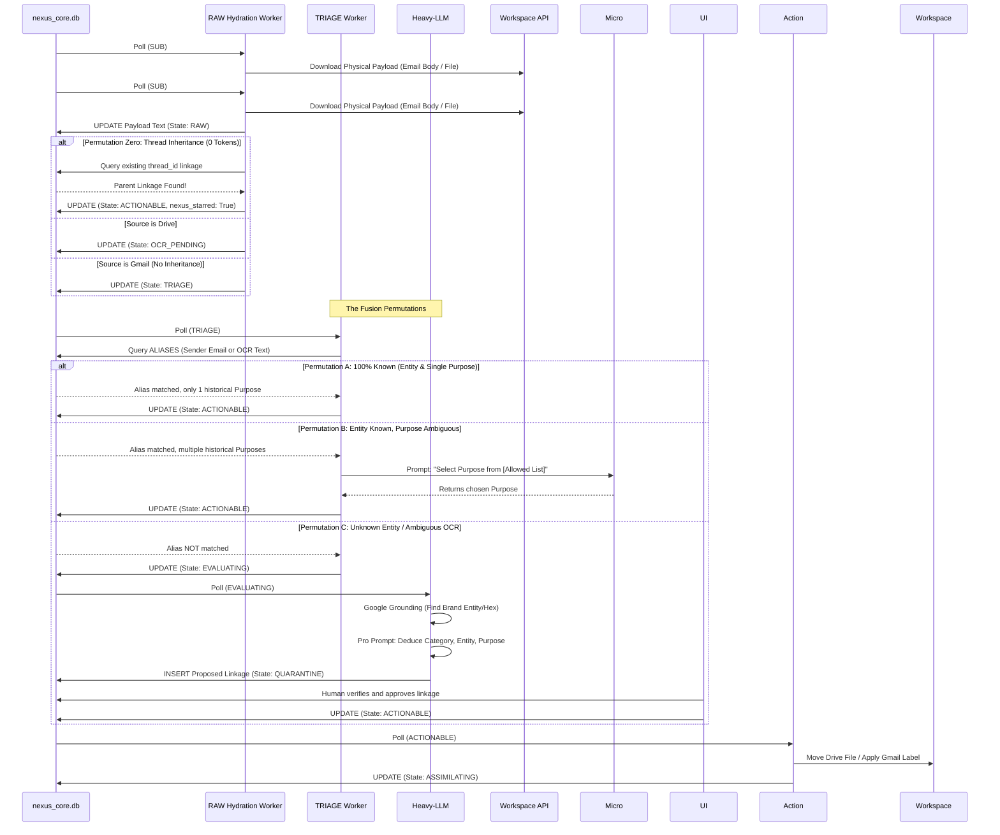

# Layer 3: The State Machine

## 3.1 The Asynchronous Fusion Engine
Nexus contains NO linear Python pipelines. Every step of processing is handled by an isolated, asynchronous worker loop that queries `WORKSPACE_ARTIFACTS` for a specific `state`.

###   `SUB` (Pub/Sub Envelope Ingress)
*   **Trigger:** Google Webhooks hit the API. 
*   **Action:** The API base64-decodes the Pub/Sub `message.data` payload and inserts the notification envelope JSON (e.g., Gmail `historyId` or Drive `resourceId`) temporarily into the `context_hint` column. Sets state to `SUB` and returns HTTP 202 instantly. No file downloading happens here.

###   `RAW` (Payload Hydration)
*   **The History ID Split & Deduplication Law:** A `SUB` artifact is merely a trigger. For Gmail, the worker unpacks the `historyId` and calls `users.history().list`. For *every* `messageId` found, it fetches the actual text payload. It MUST execute an `INSERT OR IGNORE` where the Primary Key `id` is the physical `messageId` (guaranteeing SQLite deduplication). 
*   After successfully spawning the artifacts, the worker MUST `DELETE` the original `SUB` trigger row.
*   **The Header Isolation Law:** To prevent overwhelming downstream LLMs, `RawWorker` MUST split the payload. Vital headers (`From`, `To`, `Subject`, `Date`, `Cc`) are saved strictly to the `extracted_headers` column as a JSON string, while the cleaned HTML/text goes into `extracted_body`.
*   **Quoted Text Stripping:** `RawWorker` MUST strip quoted historical replies (e.g., `<div class="gmail_quote">`) before saving the net-new message to `extracted_body`.
*   **The Thread Inheritance Law (Anti-Waste):** Before setting the new message's state to `TRIAGE`, the worker MUST query `WORKSPACE_ARTIFACTS` to see if its `threadId` already exists and has a `mapped_linkage_id`. If it DOES, the new message automatically inherits the `mapped_linkage_id` and bypasses routing entirely, setting its state directly to `ACTIONABLE`.

### 🟣 `OCR_PENDING` (Pre-Processing)
*   **Trigger:** Artifacts identified as Google Drive PDFs/Images.
*   **Action (Native-First Chunking):** The worker streams the file to `/tmp/`. It MUST attempt local text extraction first using `PyMuPDF`. If the extracted text is < 50 characters (a scanned document), it falls back to Document AI. To respect Document AI's 15-page synchronous limit, it uses `PyMuPDF` to chunk the PDF into 15-page batches. It sends each sequentially, concatenates the text, and deletes the `/tmp/` files.
*   **Drive Metadata Injection:** The worker MUST prepend the `File Name` and `MIME Type` to the top of the concatenated OCR text before saving it to `extracted_text` so the LLM has contextual clues about the file.
*   **Outcome:** Structured text is received, appended to `ocr_payload`. Transition to `TRIAGE`.

### 🟡 `TRIAGE` (Hybrid Routing)
*   **Trigger:** Text/Email artifacts.
*   **Action:** Execute the Hybrid SQL/Micro-LLM pass (See `04_COGNITIVE_AI.md`). 
*   **Outcome:** If Identity and Purpose are confidently resolved and match an active linkage, transition to `ACTIONABLE`. If Identity is unknown or Purpose is novel, transition to `EVALUATING`.

### 🟠 `EVALUATING` (Heavy LLM Fusion)
*   **Trigger:** Novel or ambiguous artifacts.
*   **Action:** Route to heavy reasoning model (See `04_COGNITIVE_AI.md`) to deduce Category, Entity, Sub-Entity, and Purpose simultaneously.
*   **Outcome:** Propose a new taxonomy linkage. Transition to `QUARANTINE`.

### 🔴 `QUARANTINE` (Human-in-the-Loop)
*   **Action:** Worker ignores this state. Artifact waits indefinitely until a human approves the proposed linkage via the UI Taxonomy Management Console. Upon approval, state manually updates to `ACTIONABLE`.

### 🔵 `ACTIONABLE` (Workspace Mutation)
*   **Action:** The Executor reads physical `label_id` / `folder_id` from `LABEL_REGISTRY` and `FOLDER_REGISTRY`. (See `05_WORKSPACE_SYNC.md`).
*   **Physical Sync:** Applies the label/moves the folder natively in Workspace. 
*   **Outcome:** Transition to `ASSIMILATING`.

### 🧠 `ASSIMILATING` (RAG Knowledge Graph Extraction)
*   **Action:** Worker queries `CONFIG_PROMPTS` using the Purpose's `extraction_prompt_id`.
*   **Data Split:** 
    1. Extracts a 1-3 sentence `ui_summary`. Writes to `nexus_core.db`.
    2. Extracts dense JSON key-value facts (e.g., `{"Total": 45.00}`). Writes to `nexus_kb.db`.
*   **The Text Purge Law:** Once semantic data is successfully extracted, the raw payload is dead weight. To prevent massive database bloat, the worker MUST execute `UPDATE WORKSPACE_ARTIFACTS SET state = 'COMPLETED', extracted_headers = NULL, extracted_body = NULL WHERE id = ?`.*   **The Text Purge Law:** Once semantic data is successfully extracted, the raw payload is dead weight. To prevent massive database bloat, the worker MUST execute `UPDATE WORKSPACE_ARTIFACTS SET state = 'COMPLETED', extracted_headers = NULL, extracted_body = NULL WHERE id = ?`.
*   **Outcome:** Transition to `COMPLETED`.

### `ERROR` (The Dead Letter State)
*   **Trigger:** Any worker encounters an unhandled exception, permanent API crash (HTTP 429/500 limits exceeded), or unreadable file corruption.
*   **Action:** The worker catches the exception, updates the state to `ERROR` to drop the database lock, and writes the stack trace and payload to local disk for the Watchdog to batch-upload to Google Drive (`Nexus_System/Diagnostics/`).
*   **Outcome:** Artifact is parked. Requires manual user intervention in the UI to click "Retry" (which resets the state to `RAW`) or "Discard".

## 3.2 The Fusion Permutation Sequences

The following Mermaid sequence dictates EXACTLY how artifacts flow through the State Machine based on what is known (SQL) vs. what is unknown (LLMs). Agents MUST NOT invent paths outside of these defined permutations.



## 3.3 The Sweeper Engine & Batch Strategy
Nexus MUST seamlessly handle massive historical data imports without locking the UI, delaying real-time webhooks, or exhausting LLM API budgets.

### 3.3.1 The Priority Polling Law
Every single Asynchronous Worker (`TRIAGE`, `EVALUATING`, `ASSIMILATING`, `ACTIONABLE`) MUST pull its next task using strict priority ordering:
`SELECT * FROM WORKSPACE_ARTIFACTS WHERE state = '[TARGET_STATE]' ORDER BY priority ASC LIMIT X`
*Result:* If a live webhook (`priority=1`) arrives while 50,000 legacy items (`priority=3`) are processing, the live email immediately jumps to the front of the line at every state transition.

### 3.3.2 The Sweeper Ingress & Context Hints
Instead of webhooks, historical data is ingested via a background `sweeper_engine` worker (harvested from the Dead Repo concepts).
- It paginates chronologically backwards through Workspace APIs.
- **Context Hints:** If the Sweeper imports an email from a legacy folder (e.g., `Old_Taxes/2021`), it injects that string into `context_hint`. The `EVALUATING` LLM uses this hint to radically reduce hallucination and token usage.
- **Backpressure:** The Sweeper MUST pause pagination if the `EVALUATING` queue exceeds a safe threshold (e.g., 100 items) to prevent `HTTP 429` rate limits.

### 3.3.3 The Batch-Triage Law (Sender Locking)
To prevent LLM API bankruptcy during a batch import, the `TRIAGE` worker MUST enforce Sender Locking.
- If `TRIAGE` encounters an unknown `source_sender` (e.g., `newsletter@target.com`), it checks if another artifact from that exact sender is *already* currently in the `EVALUATING` or `QUARANTINE` state.
- **If YES:** The worker skips the artifact, leaving it parked in `TRIAGE` (Do not send to LLM).
- **If NO:** The worker advances exactly *one* artifact for that sender to `EVALUATING`. 
- **The Result:** The heavy LLM evaluates `Target` exactly *once*. The human approves it in `QUARANTINE`. On the next loop, the remaining 999 `Target` emails waiting in `TRIAGE` instantly hit the SQL-Fast-Pass (Permutation A), costing zero API tokens.

### 3.3.4 Sweeper Backpressure & Concurrency (Anti-Lockout)
When the Sweeper Engine imports thousands of legacy emails, parallel AI workers trying to update those rows will collide.
*   **Atomic Claiming:** When an async worker claims a single artifact, it MUST use a `BEGIN IMMEDIATE` transaction or atomic `UPDATE ... RETURNING` syntax. 
*   **Batch Claiming (The CTE Law):** When claiming bulk artifacts (e.g., in `ACTIONABLE` for Gmail batch label application), the worker MUST use a Common Table Expression (CTE) to atomically lock multiple rows that share the exact same routing destination:
    ```sql
    WITH TargetLinkage AS (
        SELECT mapped_linkage_id FROM WORKSPACE_ARTIFACTS 
        WHERE state = 'ACTIONABLE' AND source_system = 'gmail' AND locked_at_ts IS NULL 
        ORDER BY priority ASC LIMIT 1
    )
    UPDATE WORKSPACE_ARTIFACTS SET locked_at_ts = ? WHERE id IN (
        SELECT id FROM WORKSPACE_ARTIFACTS 
        WHERE state = 'ACTIONABLE' AND source_system = 'gmail' AND locked_at_ts IS NULL 
        AND mapped_linkage_id = (SELECT mapped_linkage_id FROM TargetLinkage)
        ORDER BY priority ASC
        LIMIT 100
    ) RETURNING *;
    ```
*   **Sweeper Backpressure:** The Sweeper Engine MUST check the active backlog. If the count exceeds **250 items**, it yields the event loop (`await asyncio.sleep(60)`).

## 3.4 The Watchdog Engine (Renewals, Zombies, & Pruning)
A background task `WATCHDOG_ENGINE` loop runs at defined intervals to ensure systemic health and prevent data bloat.
1. **Webhook Renewals (Every 12h):** Queries `WEBHOOK_REGISTRY` for any `channel_id` expiring within 48 hours. Negotiates a new watch channel and stops the old one.
2. **Zombie Reclamation (Every 5m):** Queries `WORKSPACE_ARTIFACTS` for items in an active processing state where `locked_at_ts` is older than 15 minutes. 
   - **The Anti-Duplication Law:** The Watchdog MUST ONLY execute `UPDATE WORKSPACE_ARTIFACTS SET locked_at_ts = NULL`. It is **STRICTLY FORBIDDEN** from changing the `state` column. Reverting an `ASSIMILATING` artifact back to `TRIAGE` causes duplicate LLM token usage. Dropping the lock allows the correct worker to naturally resume processing.
3. **Database Telemetry Pruning (Daily):** Reads the `db_audit_retention_days` setting from `CONFIG_SYSTEM` (Default: 90). The Watchdog automatically `DELETE`s rows from `AI_AUDIT_LOGS` where the parent artifact is in the `COMPLETED` or `IGNORED` state and the log is older than the threshold. **The Quarantine Law:** The Watchdog is STRICTLY FORBIDDEN from deleting logs tied to an artifact currently in the `QUARANTINE` or `ERROR` state, regardless of age. If the setting is `0`, deletion is bypassed entirely (Never Delete).
4. **Drive Quota Management (Daily):** Reads the `drive_log_retention_days` setting (Default: 30). The Watchdog queries the Google Drive API for files in `Nexus_System/Logs/` older than the threshold and permanently deletes them to protect the user's 15GB free tier. If the setting is `0`, deletion is bypassed entirely.

## 3.5 The Infinite Loop Law (Lifespan vs BackgroundTasks)
Workers MUST NOT be implemented as FastAPI `BackgroundTasks` triggered by web routes, as they will die when web traffic stops.
- **Implementation:** All Asynchronous Workers (`TRIAGE`, `SWEEPER`, `WATCHDOG`, `ACTIONABLE`, etc.) MUST be spawned as independent `asyncio.create_task()` loops within the FastAPI `@asynccontextmanager lifespan` hook.
- **Fault Tolerance:** Every infinite `while True:` worker loop MUST be wrapped in a broad `try/except Exception as e:` block. If a worker encounters a fatal error, it must log the error, execute `await asyncio.sleep(10)`, and continue the loop. Workers are FORBIDDEN from silently crashing and abandoning their thread.