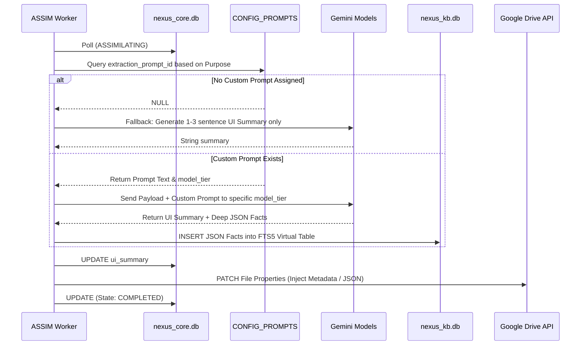
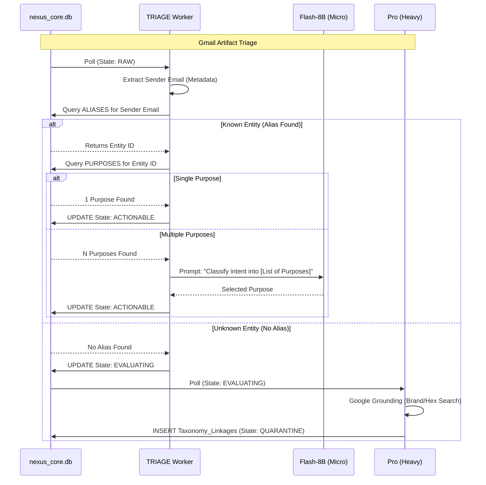
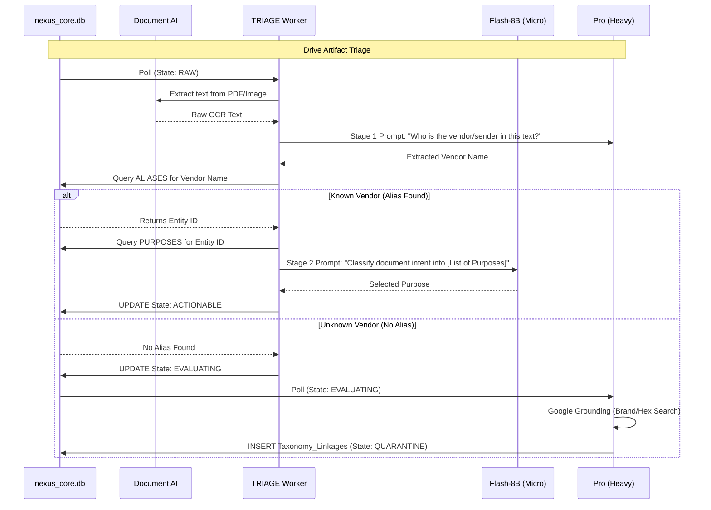

# Layer 4: Cognitive AI & LLM Routing

## 4.1 Tiered LLM Philosophy (Cost & Speed Optimization)
Nexus V3 protects API budgets by deploying Tiered LLM routing. The system matches the token cost and latency to the cognitive complexity of the task.
- **Fast-Pass Triage (`gemini-2.5-flash-8b`):** Used for micro-evaluations (e.g., matching text against a known array of purposes).
- **Data Extraction (`gemini-2.5-flash`):** Used for standard JSON key-value extraction during the RAG phase.
- **Heavy Evaluation (`gemini-2.5-pro`):** Used strictly for novel taxonomy generation, complex deductive reasoning, and UI theme generation.

## 4.2 `TRIAGE` (Hybrid SQL + Micro-LLM Pass)
To avoid writing brittle regex parsers while maintaining cost efficiency, `TRIAGE` uses a hybrid approach:
1. **SQL Identity Pass:** The worker queries `ALIASES`. If the sender exactly matches a known `Entity` (e.g., `receipts@amazon.com` = `Amazon`), the `Category` and `Entity` are locked with 1.0 confidence. *Zero LLM tokens used.*
2. **Micro-LLM Purpose Pass:** Because an entity can send multiple artifact types (e.g., Amazon sends `Receipt`, `Promo`, and `Delivery`), the worker passes a text snippet to a Fast-Pass LLM.
   - *Constraint:* The prompt forces the LLM to choose *strictly* from the existing, historically known Purposes for that specific Entity, drastically reducing hallucination risk and token count.
3. **Velocity Tracker (Starred):** If the payload is an email thread, the worker calculates a 7-day interaction velocity window. Multiple back-and-forth replies trigger `nexus_starred = True`.

## 4.3 `EVALUATING` (Heavy Taxonomy Fusion)
Triggered only for novel entities or completely ambiguous artifacts.
1. **Simultaneous Deduction:** The Heavy Evaluation prompt instructs the LLM to read the 16-Category and 20-Purpose taxonomy map and simultaneously deduce `Category`, `Entity`, `Sub-Entity`, and `Purpose`. 
2. **True Importance Override:** Google's native algorithmic tagging artificially flags marketing as "Important" to drive engagement. The LLM evaluates true urgency, financial impact, or legal necessity. If `nexus_important = False`, Nexus will explicitly strip the native `IMPORTANT` tag via the Gmail API.
3. **Google Grounding (Brand Entity):** The LLM queries Google Grounding to discover the entity's true brand hex color (e.g., Home Depot = `#F96302`) and writes it to `ENTITIES.primary_color_hex`.

## 4.4 `ASSIMILATING` (Deep RAG Extraction)
Instead of generic summaries, extraction is strictly tied to the artifact's `Purpose`.
1. The worker fetches the exact prompt tied to the `Purpose` (e.g., `EXTRACT_FINANCE` for an `Invoice`).
2. **UI Output:** Extracts a tight 1-to-3 sentence `ui_summary` optimized for mobile screens (saved to `nexus_core.db`).
3. **KB Output:** Extracts structured JSON key-value pairs representing deep facts (saved to `nexus_kb.db` via FTS5).

## 4.5 Prompt Invocation Sequence (The RAG Pipeline)

When an artifact reaches `ASSIMILATING`, the LLM must extract data. The coding agent MUST follow this logic tree to prevent hallucinating extractions for Purposes that do not require them.

## 4.6 The Permutation Sequence Diagrams (Routing Logic)

To prevent brittle `if/else` spaghetti code, all artifacts MUST be routed through the following strict permutations.

### 4.6.1 Gmail Permutations
Gmail artifacts have reliable metadata (Sender Email) that allows for a fast SQL lookup before involving LLMs.

### 4.6.2 Google Drive Permutations
Drive artifacts rely on raw OCR text and require a Two-Stage Prompt to avoid overwhelming the LLM.

### 4.7 Context Window Truncation Strategy
To prevent token limit exhaustion and kernel panics (e.g., from a 50-page PDF or a 100-reply email thread), the system MUST enforce strict text truncation before passing payloads to the LLM.
1. Gmail Threads (Reverse Chronological):
   - Truncate the thread to keep only the most recent messages, up to a strict maximum of 8,000 tokens.
   - Drop the oldest messages in the thread if they exceed the limit.
2. **Drive Documents (Formatting & 5-Page Hard Limit):**
   - Document AI's synchronous endpoint strictly rejects documents over 15 pages.
   - **Native Google Docs:** Cannot be sliced natively. The worker MUST call the Drive API `export` method with `mimeType='application/pdf'` before proceeding.
   - **Images (JPEG/PNG):** Bypass the slicer entirely. They are 1-page by definition and passed directly to Document AI via base64.
   - **PDF Slicing:** All PDFs MUST be sliced locally on disk to the **first 5 pages** before base64 encoding to stay within the 1GB VM memory limit and prevent context hallucination.